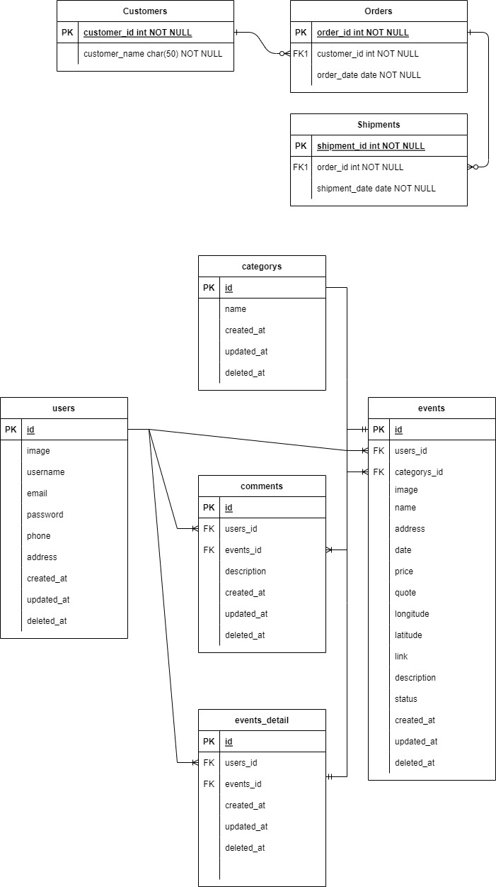

# Group 4 Event Apps - GOMEET

<!-- PROJECT LOGO -->
<br/>
<div align="center">
<!--  mengarah ke repo  -->
  <a href="https://github.com/ALTA-BE9-Mulya-Nurdin/BE9-Event-App-Project#group-4-event-apps---gomeet">
    
  </a>

<h3 align="center">GOMEET</h3>

  <p align="center">
    Event Application Group Project 4
    <br />
    <a href="https://app.swaggerhub.com/apis-docs/ADNANAZIS9971/gomeet/1.0.1"><strong>» Open API »</strong></a>
    <br />
  </p>
</div>

## How to run
- Clone or fork this project on your local.
- Create file `.env`
```go
export DB_USERNAME=<username-db>
export DB_PASSWORD=<password-db>
export DB_PORT=<port-db>
export DB_HOST=<host-db>
export DB_NAME=<name-db>
```
- Run command to call file environment
```go
$ source .env
```
- Run project
```go
$ go run main.go

   ____    __
  / __/___/ /  ___
 / _// __/ _ \/ _ \
/___/\__/_//_/\___/ v4.7.2
High performance, minimalist Go web framework
https://echo.labstack.com
____________________________________O/_______
                                    O\
⇨ http server started on [::]:8000

```
## ERD



## Environment GCS
- Create new project on your google cloud platform
- Create new bucket on google cloud storage and fill in the existing fields:
  - Name bucket
  - Location data store
  - Class of storage
  - Control access to object
  - Protect object data
- Setup your bucket for public access
  - Access your bucket with public link `https://storage.googleapis.com/bucket_name/` + `nama_file.png`
- Generate access-key for service account with format `.json`
 
