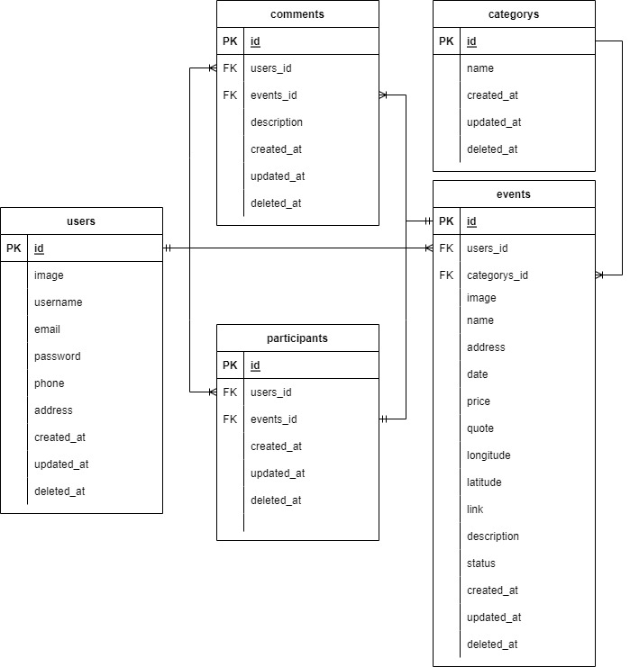

# Group 4 Event Apps - GOMEET

<!-- PROJECT LOGO -->
<br/>
<div align="center">
<!--  mengarah ke repo  -->
  <a href="https://github.com/ALTA-BE9-Mulya-Nurdin/BE9-Event-App-Project#group-4-event-apps---gomeet">
    
  </a>

<h3 align="center">GOMEET</h3>

  <p align="center">
    Event Application Group Project 4
    <br />
    <a href="https://app.swaggerhub.com/apis-docs/ADNANAZIS9971/gomeet/1.0.1"><strong>» Open API »</strong></a>
    <br />
  </p>
</div>

## How to run
- clone or fork this project on your local.
- create file `.env`
```go
export DB_USERNAME=<username-db>
export DB_PASSWORD=<password-db>
export DB_PORT=<port-db>
export DB_HOST=<host-db>
export DB_NAME=<name-db>
```
- run command to call file environment
```go
source .env
```
- and run project
```go
go run main.go

   ____    __
  / __/___/ /  ___
 / _// __/ _ \/ _ \
/___/\__/_//_/\___/ v4.7.2
High performance, minimalist Go web framework
https://echo.labstack.com
____________________________________O/_______
                                    O\
⇨ http server started on [::]:8000

```
## ERD



## Environment GCS
- link bucket: `https://storage.googleapis.com/event2022/` + `nama_file.png`
- name bucket: "event2022"
- service-account-key: `service-account-file.json`
 
